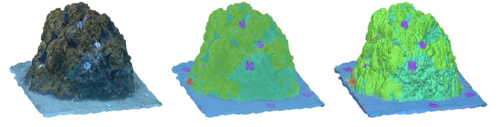
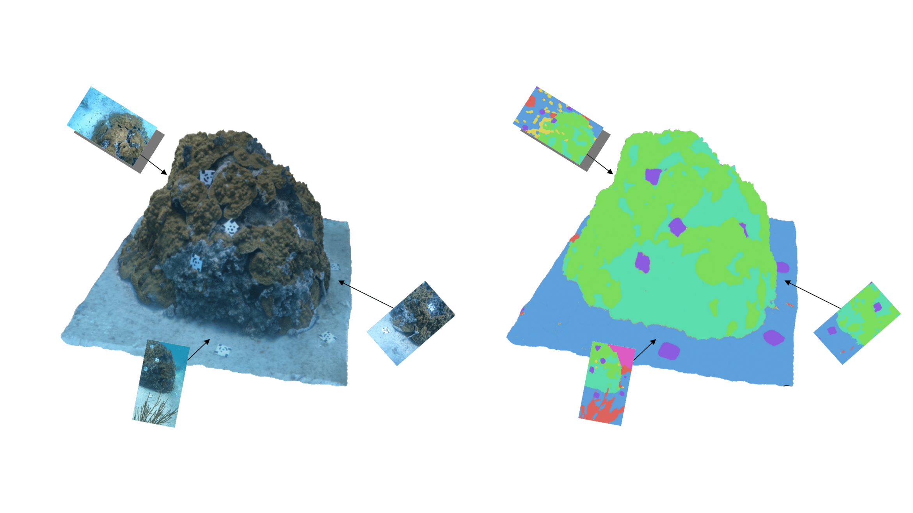
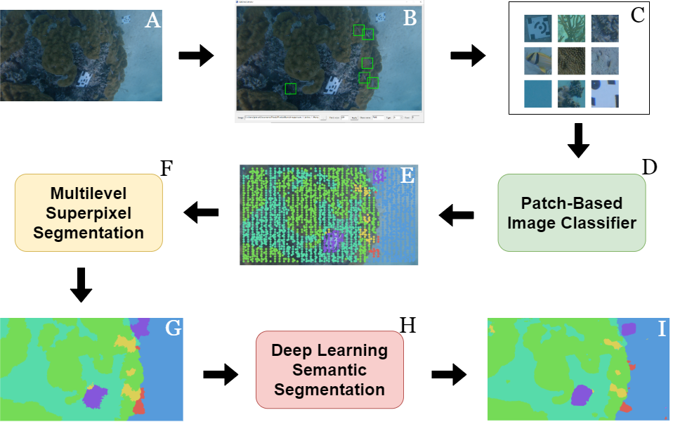
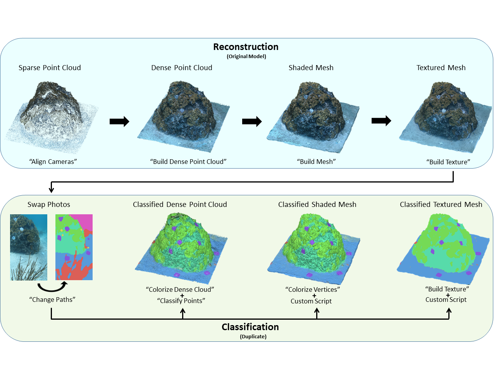

# Classifying 3D Models of Coral Reefs using Structure-from-Motion and Multiview Semantic Segmentation

We present a method to efficiently provide semantic labels of functional groups to 3D reconstructed models created from commonly used SfM software (i.e., Agisoft Metashape) using Fully Convolutional Networks (FCNs). Unlike other methods, ours involves creating dense labels for each of the images used in the 3-D reconstruction and then reuses the projection matrices created during the SfM process to project semantic labels onto either the point cloud or mesh to create fully classified versions (link to paper [here](https://www.frontiersin.org/articles/10.3389/fmars.2021.706674/full)).  

Although SfM has become widely adopted by ecologists, deep learning presents a steep learning curve for many. Because of this we provide a comprehensive workflow with detailed instructions and open-sourced our programming code to assist others in replicating our methodology. Our method provides researchers with the ability to assess precise changes in 3-D community composition of reef habitats in an entirely novel way, providing more insight into changes in ecological paradigms, such as those that occur during coral-algae shifts.  

This repository contains the code used for workflow; classification of the 3D models is done in Agisoft Metashape.

# Workflow:    

### Obataining Dense Labels

The first half of the workflow involves obtaining dense (i.e., pixel-wise) labels for each of the images used in the 3-D model reconstruction. This half was done entirely in python using the code that can be found in the `Notebooks` directory. Outlined below are the steps used in our paper:

A.) Extract still images from video footage;  
B.) Import into [`Patch Extractor`](https://github.com/JordanMakesMaps/3D-Model-Classification/releases) or similiar tool (e.g., [CPCe](https://hcas.nova.edu/tools-and-resources/cpce/index.html) or [CoralNet](https://coralnet.ucsd.edu/));  
C.) Extract patches of each class category of interest;    
D.) Train a patch-based image classifier (e.g., convolutional neural network);  
E.) Use trained classifier to automatically add additional sparse labels to each image;  
F.) Pass sparse labels and corresponding images to [Fast-MSS](https://github.com/JordanMakesMaps/Fast-Multilevel-Superpixel-Segmentation);    
G.) Convert sparse to dense labels automatically;    

*Optional:*  
H.) Train a deep learning [semantic segmenation algorithm](https://github.com/qubvel/segmentation_models) on dense labels;  
I.) Use deep learning model to obtain more accurate dense labels for these images, and those collected from similar habitats, thus skipping steps A - H.  

### Classifying 3-D Models

The second half of the workflow involves reconstructing a 3-D model using Structure-from-Motion (SfM) algorithms. Like many other benthic ecologists, we used Agisoft Metashape. Following the standard SfM workflow, once the textured mesh was created, source images were swapped with their corresponding dense labels and a new textured mesh was created these instead. With a classified textured mesh, one can obtain a classified mesh or dense point cloud by using the `colorize vertices` and `colorize dense points` tool, respectively. All 3-D model types can be exported from Metashape w/ their classifications as popular formats including `obj.`, `.ply`, `laz.`.

#### Notes:
- When creating the classified textured mesh using `build texture`, if `blending` is not disabled, then it is possible that the RGB color component values representing class categories will be averaged together. The ramifications of this is that values representing class categories go from being discrete `[0, 1, 2, 3..]` to continuous, which is not ideal for analysis. With the dense point cloud, each point's RGB color component can be corrected using the `classify points` tool. 

#### Citation:

`
Pierce, J., Butler, M. J., Rzhanov, Y., Lowell, K., &amp; Dijkstra, J. A. (2021). Classifying 3-D models of coral reefs using structure-from-motion and multi-view semantic segmentation. Frontiers in Marine Science, 8. https://doi.org/10.3389/fmars.2021.706674 
`

# Requirements:  
- cv2
- numpy
- pandas
- skimage
- matplotlib
- [fast_slic](https://github.com/Algy/fast-slic)
- [fast-mss](https://github.com/JordanMakesMaps/Fast-Multilevel-Superpixel-Segmentation) 

# TODO
- ~Finish readme~
- ~Update notebooks to include markdown comments~
- Provide python code for editing vertices' colors to discrete class categories
